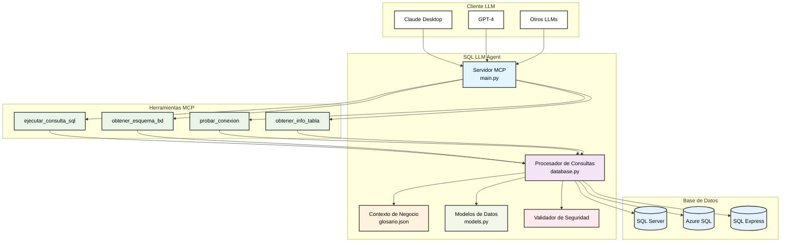

# SQL LLM Agent 🤖

<div align="center">


[](https://opensource.org/licenses/MIT)
[](https://www.python.org/downloads/)
[](https://www.docker.com/)

</div>

Un agente inteligente que permite consultas SQL seguras a través del protocolo MCP, adaptable a cualquier base de datos SQL Server con contexto de negocio personalizable.

## 🏗️ Arquitectura



### Flujo de Datos:

1. **Cliente LLM** envía consulta en lenguaje natural
2. **Servidor MCP** recibe y procesa la solicitud
3. **Contexto de Negocio** enriquece la comprensión
4. **Validador de Seguridad** verifica la consulta SQL
5. **Procesador** ejecuta consulta segura en la base de datos
6. **Respuesta** estructurada regresa al cliente LLM

## 🚀 Características

- **Consultas seguras**: Solo SELECT, validación automática de sintaxis
- **Protocolo MCP**: Compatible con Claude, GPT-4 y otros LLMs
- **Contexto inteligente**: Sistema de glosario personalizable para cualquier dominio
- **Multi-base de datos**: Adaptable a cualquier esquema SQL Server
- **Docker ready**: Despliegue sencillo y escalable

## 🛠️ Instalación Rápida

```bash
git clone https://github.com/Arnaud-Chafai/Agent-Database-Reader.git
cd Agent-Database-Reader
cp .env.example .env
# Configurar .env con tu base de datos
docker-compose up -d
```

## ⚙️ Configuración

Crear `.env` con tu configuración de base de datos:

```env
DB_SERVER=TU_SERVIDOR\INSTANCIA_SQL
DB_DATABASE=tu_base_datos
DB_USERNAME=tu_usuario
DB_PASSWORD=tu_contraseña
DB_DRIVER=ODBC Driver 17 for SQL Server
```

El agente se adaptará automáticamente al esquema de tu base de datos.

## 🔧 Herramientas MCP

1. **`ejecutar_consulta_sql`** - Ejecuta consultas SELECT con contexto automático
2. **`obtener_esquema_bd`** - Analiza estructura de cualquier base de datos
3. **`probar_conexion`** - Verifica conectividad
4. **`obtener_info_tabla`** - Información detallada de tablas

## 📊 Ejemplos de Uso

### Para cualquier base de datos:
```sql
-- Explorar esquema
SELECT TABLE_NAME, COLUMN_NAME, DATA_TYPE 
FROM INFORMATION_SCHEMA.COLUMNS 
WHERE TABLE_CATALOG = 'tu_base_datos'

-- Análisis de datos
SELECT TOP 10 * FROM tu_tabla 
ORDER BY tu_columna_fecha DESC

-- Conteos y agregaciones
SELECT 
    columna_categoria,
    COUNT(*) as total,
    AVG(columna_numerica) as promedio
FROM tu_tabla
GROUP BY columna_categoria
```

### Base de datos de ejemplo (Chinook):
```sql
-- Top productos por ventas
SELECT TOP 10 
    p.Name as Producto,
    COUNT(*) as Ventas
FROM Products p
JOIN OrderDetails od ON p.ProductId = od.ProductId
GROUP BY p.Name
ORDER BY Ventas DESC
```

## 🧠 Contexto Personalizable

Edita `context/glosario.json` para adaptar el contexto a tu dominio:

```json
{
  "conceptos_negocio": {
    "tu_dominio": {
      "descripcion": "Descripción de tu área de negocio",
      "tabla_principal": "tu_tabla_principal", 
      "metricas_clave": ["campo1", "campo2", "campo3"]
    }
  },
  "sinonimos": {
    "ventas": ["orders", "transactions", "sales"],
    "clientes": ["users", "customers", "clients"]
  }
}
```

## 🏗️ Estructura del Proyecto

```
sql-llm-agent/
├── src/sql_llm_agent/
│   └── mcp_server/
│       ├── main.py           # Servidor MCP con FastAPI
│       ├── database.py       # Adaptador SQL Server universal
│       └── models.py         # Modelos de datos
├── context/
│   └── glosario.json        # Contexto personalizable
├── docker-compose.yml       # Configuración Docker
├── Dockerfile              # Python 3.12 + ODBC
├── .env.example            # Template configuración
└── build-docker.bat        # Script Windows
```

## 🔒 Seguridad

- ✅ Solo consultas SELECT permitidas
- ✅ Validación de palabras prohibidas (DROP, DELETE, UPDATE, etc.)
- ✅ Límite automático de resultados (TOP 100)
- ✅ Variables de entorno para credenciales
- ✅ Logs seguros (stderr, no stdout)

## 🐳 Docker

```bash
# Construcción
build-docker.bat  # Windows
# o
docker build -t sql-llm-agent .

# Ejecución
docker-compose up -d

# Monitoreo
docker logs -f sql-llm-agent-mcp
```

## 🤝 Integración con LLMs

### Claude Desktop
```json
{
  "mcpServers": {
    "sql-agent": {
      "command": "uv",
      "args": ["run", "python", "-m", "src.sql_llm_agent.mcp_server.main"],
      "cwd": "/ruta/a/sql-llm-agent"
    }
  }
}
```

### Otras integraciones MCP
Compatible con cualquier cliente que implemente el protocolo MCP.

## 🚨 Troubleshooting

```bash
# Verificar conexión a tu base de datos
uv run python -c "from src.sql_llm_agent.mcp_server.database import DatabaseManager; print(DatabaseManager().test_connection())"

# Listar drivers ODBC disponibles
odbcinst -q -d

# Cambiar puerto si está ocupado
# En .env: MCP_PORT=8001
```

## 📝 Desarrollo

```bash
# Instalación local
pip install uv
uv sync

# Ejecutar servidor en desarrollo
uv run python -m src.sql_llm_agent.mcp_server.main

# Tests
uv run pytest

# Formateo de código
uv run black src/
```

## 🗄️ Bases de Datos Compatibles

- ✅ **SQL Server** (todas las versiones modernas)
- ✅ **Azure SQL Database**
- ✅ **SQL Server Express**
- 🔄 **Próximamente**: PostgreSQL, MySQL

## 🎯 Casos de Uso

- **Análisis de datos** con lenguaje natural vía LLMs
- **Exploración de esquemas** de bases de datos desconocidas  
- **Generación de reportes** automáticos
- **Validación de datos** y calidad
- **Documentación automática** de bases de datos

## 👨‍💻 Autor

**Arnaud Chafai**  
[](https://github.com/Arnaud-Chafai)
[](https://github.com/Arnaud-Chafai/Agent-Database-Reader)

---

<div align="center">

⭐ **¿Te gusta el proyecto?** ¡Dale una estrella!  
🐛 **¿Encontraste un bug?** [Abre un issue](https://github.com/Arnaud-Chafai/Agent-Database-Reader/issues)  
💡 **¿Tienes una idea?** [Crea una discussion](https://github.com/Arnaud-Chafai/Agent-Database-Reader/discussions)

**[⬆ Volver arriba](#sql-llm-agent-)**

</div>